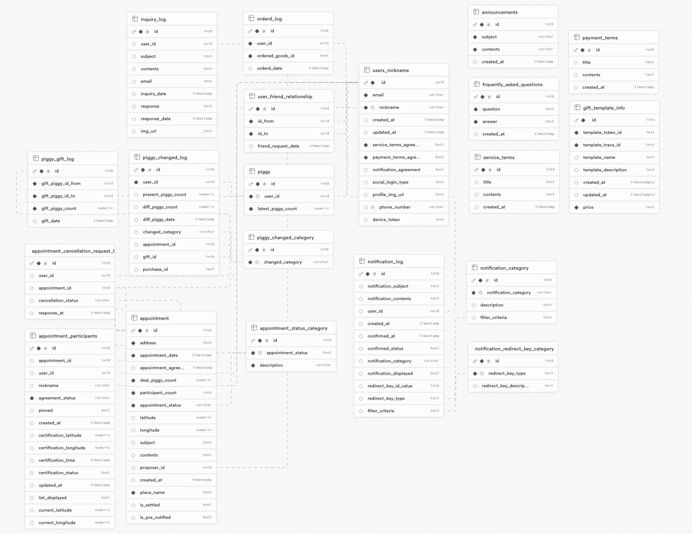

## 🐽 PIGGY

PIGGY는 사용자가 다른 사용자와 약속을 생성하고 해당 약속의 정보를 함께 관리할 수 있는 커뮤니티 앱입니다.  
친구들과 함께 약속을 세우고, 그 약속을 잊지 않고 성실히 이행할 수 있도록 **동기부여**와 **보상**을 결합한 시스템을 제공하고 있습니다.  
PIGGY는 시간 관리와 약속의 중요성을 강조하면서도, 이를 게임화하여 재미있고 유익한 방식으로 제공합니다.
 
 

## ✍️ 기획 배경

🤔 약속을 잘 지키지 않는 사람들도 약속을 지키도록 하려면 어떻게 해야할까?  
😮 약속을 잘지키는 사람들은 그에 합당한 보상이 있었으면 좋겠다!  
😐 반대로 약속 이행률이 낮은 사람들은 패널티를 부여할 수 있도록 설정하자!  
👉🏻 우리가 이런 기능을 제공하는 애플리케이션을 만들어보자!
 
 

## 🪄 주요 기능

1. **약속 생성 및 관리**:

   사용자는 PIGGY 앱에서 간편하게 약속을 생성할 수 있습니다.  
   약속 장소를 지도에서 선택하고, 날짜와 시간을 설정한 후 친구들을 초대할 수 있습니다.  
   약속은 단순한 모임뿐만 아니라 다양한 활동에 활용될 수 있습니다.

2. **PIGGY 포인트 시스템**:

   약속을 만들 때, 사용자는 "PIGGY 포인트"를 보증금으로 설정할 수 있습니다.  
   모든 참여자는 이 포인트를 걸어두어야 하며, 약속을 성실하게 지키는 것을 독려합니다.

3. **보증금 제도**:

   약속을 지키지 않는 경우, 해당 사용자가 걸어둔 PIGGY 포인트는 약속을 지킨 친구들에게 자동으로 분배됩니다.  
   이 시스템은 사용자가 약속을 지키도록 동기부여하며, 약속을 지킨 사람들에게는 추가적인 보상을 제공합니다.

4. **PIGGY 포인트 사용**:

   사용자가 모은 PIGGY 포인트는 앱 내 상점에서 물건을 구매하는 데 사용할 수 있습니다.  
   이로 인해 PIGGY 포인트는 실제 가치를 가지게 되며, 사용자는 약속을 지킴으로써 실질적인 혜택을 얻게 됩니다.

5. **커뮤니티와 상호작용**:

   PIGGY는 단순한 약속 관리 앱을 넘어 친구들과의 상호작용을 촉진합니다.  
    약속 내역을 공유하고, 친구들과의 성과를 기록하며, 더 나아가 공동의 목표를 설정하여 협력할 수 있습니다.
    
    

## 🧑🏻‍💻 CONTRIBUTORS

<table>
  <tr>
    <td align="center" width="212px">
      
    </td>
    <td align="center" width="212px">
      
    </td>
    <td align="center" width="212px">
      
    </td>
    <td align="center" width="212px">
      
    </td>
  </tr>
  <tr>
    <td align="center">
      <a href="https://github.com/mymain838" target="_blank">
        강현
      </a>
    </td>
    <td align="center">
      <a href="https://github.com/AmitaWhite" target="_blank">
        성민
      </a>
    </td>
     <td align="center">
      <a href="https://github.com/dhdpekfa1" target="_blank">
        예닮
      </a>
    </td>
    <td align="center">
      <a href="https://github.com/dayoung-woo" target="_blank">
        다영
      </a>
    </td>
  </tr>
  <tr>
      <td align="center">FullStack & Team Leader SMS , Push Alarm , Payment 설계 </td>
      <td align="center">FullStack & DBA Table, Trigger , DB 설계</td>
      <td align="center">FullStack & Design 약속 생성 및 리스트 구현</td>
      <td align="center">FullStack & Design 실시간 위치 인증 및 타이머 구현</td>
  </tr>
</table>
 

## 🛠️ 기술 스택

|   Part   |                                                                                                                                                                                                                                                                                                                                                                                                              Tech                                                                                                                                                                                                                                                                                                                                                                                                              |
| :------: | :----------------------------------------------------------------------------------------------------------------------------------------------------------------------------------------------------------------------------------------------------------------------------------------------------------------------------------------------------------------------------------------------------------------------------------------------------------------------------------------------------------------------------------------------------------------------------------------------------------------------------------------------------------------------------------------------------------------------------------------------------------------------------------------------------------------------------: |
| BACKEND  |                                                                                                                                                                                                                                                                                                                                                                                                                                                                                                   |
| FRONTEND |         |

 

## ⚙️ ERD

 
 
 

## 💡 기능 상세
